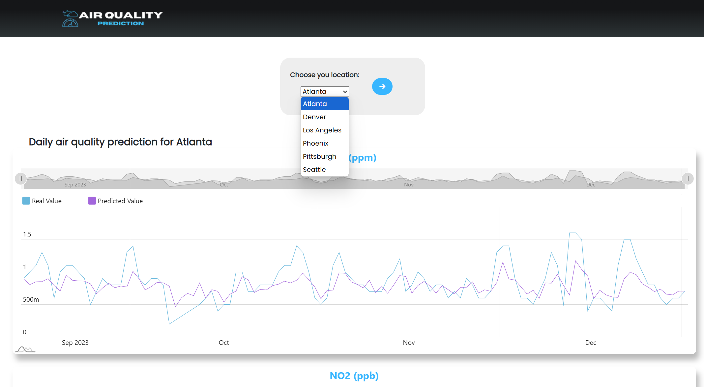

# Project For "Advanced Machine Learning Subject"

## Air Quality Prediction with LSTM
### Target:
The target of this application is to provide accurate air quality predictions, enabling individuals to minimize exposure to harmful pollutants and make informed decisions for health and environmental sustainability.

### Motivation:
Air quality directly impacts human health, environmental sustainability, and overall quality of life. With the increasing levels of urbanization, industrialization, and climate change, poor air quality has become a pressing global challenge. People are more aware than ever of the need to monitor air quality to make informed decisions that can protect their health and the environment.

An air quality prediction application addresses this need by providing accurate and timely forecasts of air pollution levels. It empowers individuals, communities, and policymakers with actionable insights. For example:

- Health Protection: Air pollution is linked to respiratory diseases, cardiovascular problems, and other severe health conditions. A prediction system helps users plan their outdoor activities to minimize exposure during high-risk periods.
- Environmental Awareness: By understanding patterns of air pollution, individuals and communities can take steps to reduce emissions and advocate for greener policies.
- Data-Driven Decision-Making: Industries and governments can leverage predictive insights to implement proactive measures, such as traffic restrictions, emission controls, or public advisories, before pollution levels exceed safe thresholds.
- Climate Change Mitigation: Tracking air quality data over time helps in understanding trends, identifying pollution hotspots, and devising long-term strategies to mitigate environmental impacts.

### Application:
This application will allow users to view detailed charts of pollutant levels for several cities across the United States, using data sourced from the Environmental Protection Agency (EPA). These visualizations will help users track air quality trends, compare pollution levels across locations, and gain insights into environmental conditions.

### Results
Air Quality Factors Monitored in Major U.S. Cities
**Cities**:  
> Denver, Los Angeles, Phoenix, Pittsburgh, Seattle
---
Source of data:
[United States Environmental Protection Agency]([https://en.wikipedia.org/wiki/Air_quality_index](https://www.epa.gov/outdoor-air-quality-data))

#### Key Air Quality Indicators
Factors taken into consideration during prediction process can be seen in the table below:

| **Factor**                           | **Unit**                           | **Source**                                                                            | **Health Impact**                                                                                        | **Air Quality Standard (USA)**                        | **Environmental Impact**                                                 |
|--------------------------------------|------------------------------------|---------------------------------------------------------------------------------------|----------------------------------------------------------------------------------------------------------|-------------------------------------------------------|--------------------------------------------------------------------------|
| **CO (Carbon Monoxide)**             | Parts per million (ppm)            | Fossil fuel combustion (vehicles, furnaces, power plants)                             | Reduces oxygen delivery in the body, leading to hypoxia                                                  | 9 ppm (8-hour average); 35 ppm (1-hour average)       | Low direct effect, may indirectly contribute to ground-level ozone       |
| **NO₂ (Nitrogen Dioxide)**           | Parts per billion (ppb)            | Vehicle emissions, fuel combustion in power plants and industry                       | Irritates respiratory pathways, increases asthma risk, and lung infections                               | 53 ppb (annual average); 100 ppb (1-hour average)     | Contributes to photochemical smog and acid rain formation                |
| **O₃ (Ozone)**                       | Parts per million (ppm)            | Formed secondary to reactions between NOₓ and VOCs under sunlight                     | Irritates respiratory pathways, causes coughing, and impairs lung function                               | 0.070 ppm (8-hour average)                            | Toxic to plants, reduces agricultural yields                             |
| **PM2.5 (Particulate Matter PM2.5)** | Micrograms per cubic meter (µg/m³) | Fossil fuel combustion, industry, vehicle emissions, natural events (e.g., wildfires) | Penetrates deep into lungs and bloodstream, increasing risks of heart, respiratory diseases, and cancers | 12 µg/m³ (annual average); 35 µg/m³ (24-hour average) | Reduces visibility, harms aquatic and terrestrial ecosystems             |
| **SO₂ (Sulfur Dioxide)**             | Parts per billion (ppb)            | Combustion of sulfur-rich fossil fuels (coal), oil refining, volcanic activity        | Irritates respiratory pathways, triggers asthma attacks                                                  | 75 ppb (1-hour average)                               | Major contributor to acid rain, damaging plants, soils, and water bodies |

[USA Regulations](https://www.epa.gov/criteria-air-pollutants)

European Air Quality Standards (for reference):
- **CO**: 10 ppm (8-hour average)  
- **NO₂**: Annual average ≤ 40 µg/m³ (~21 ppb)  
- **O₃**: Maximum 8-hour concentration ≤ 120 µg/m³ (~0.06 ppm)  
- **PM2.5**: Annual average ≤ 25 µg/m³ (WHO recommends 5 µg/m³)  
- **SO₂**: 1-hour concentration ≤ 350 µg/m³ (~132 ppb)  

[EU Regulations](https://www.eea.europa.eu/themes/air/air-quality)  

Regulations for O₃ and SO₂ are much stricter in the USA than in EU. 
But on the other hand CO, NO₂ and PM2.5 are much stricter in EU than in the USA.  

#### Model structure chosen
LSTM (Long Short-Term Memory) networks are a type of Recurrent Neural Network (RNN) specifically designed to address the challenges associated with learning from time-series data.
That is why this type of model is perfect fit (also widely used) in Air Quality analysis.  
Air quality data typically consists of time-series sets, where the measurements (CO, NO₂, O₃, PM2.5, SO₂) at each time step depend on previous observations. 
Unlike traditional RNNs, LSTM networks have specialized memory cells that allow them to remember information over long periods.  
Also vanishing gradient is an important issue to address. It's and issue where gradients become too small during backpropagation process, making it difficult to learn long-range dependencies.  
Preventing from occurring gradient problems is essential for good air quality prediction, where seasonal patterns, weather conditions, and pollution trends evolve over given periods of time. 
This is perfectly solved by LSTM architecture, which should improve prediction accuracy.


| **Parameter**     | **Description**                                                                                         | **Example**    |
|-------------------|---------------------------------------------------------------------------------------------------------|----------------|
| `input_size`      | The number of features in the input data.                                                               | 1              |
| `hidden_size`     | The number of units in the LSTM hidden layer.                                                           | 16             |
| `num_layers`      | The number of LSTM layers.                                                                              | 2              |
| `output_size`     | The number of units in the output layer.                                                                | 1              |
| `dropout`         | The proportion of LSTM units that are randomly dropped during training to prevent overfitting.          | 0.2            |
| `batch_first`     | Specifies if the input and output tensors should be in the format (batch_size, seq_length, input_size). | `True`         |
| `learning_rate`   | The learning rate for model training.                                                                   | XXXX (0.001)   |
| `optimizer`       | The optimization algorithm used for updating weights.                                                   | XXXX (Adam)    |
| `epochs`          | The number of training epochs (passes through the entire dataset).                                      | 10,15,25,35,50 |
| `sequence_length` | The number of time steps (data points) the model takes as input.                                        | XXXX (30)      |


#### Predictions
All used datasets can be found at the following path:  
```
stronka/Datasets/*.csv
```
The results comparing the actual state with the predicted state:
```
stronka/Datasets/graphs/*actual_vs_predicted.png
```
The training strategy, i.e., the most important indicator that informs how well the model fits the training data, 
can be found at the following path:
```
stronka/Datasets/graphs/*training_loss.png
```

Sample visualisation of results for prediction of Atlanta city:
- CO results
_actual_vs_predicted.png)


- NO₂ results
_actual_vs_predicted.png)

 
- O₃ results
_actual_vs_predicted.png)

 
- PM2.5 results
_actual_vs_predicted.png)

 
- SO₂ results
_actual_vs_predicted.png)


Overall, the results look good. The model accurately captures trends in the predicted data. The quality and accuracy of the fitting in characteristic points, such as local extremes on the air quality index chart, could be improved.
The model predicted results within the date range: 
> [2023-09-15 : 2024-01-01]

The prediction was made using purely historical data, but based on the following approach: 
we have data from several past years, for example, 3 years, i.e., the date range from ```[X, Y]```. 
We train the data on the period let's say of 2 years: ```[X, X+2 years]```.
Then predict the data for the period let's say of 1 year: ```[Y, Y+1 year]```. 
This approach allows us to assess how the model performs in real-world conditions.  
Real-time predictions would require integration with a large amount of quality data from sensors 
or possibly some commercial API in a paid model.  
Additionally, computational resources would need to be increased for such a model to work in real-time. Currently, the model runs on a local CPU:
```python
model.load_state_dict(torch.load('./stronka/PT/O3_PT_lstm_model.pth', map_location=torch.device('cpu')))
```
However, scaling it to a very high computational performance will not be difficult.

#### App
The application encapsulates the model's functionality and the ability to predict air quality in the form of a convenient interface and a simple API. The application is built using Flask and Vanilla JS.
Sample screenshots from user interface:  
  
  

:)
